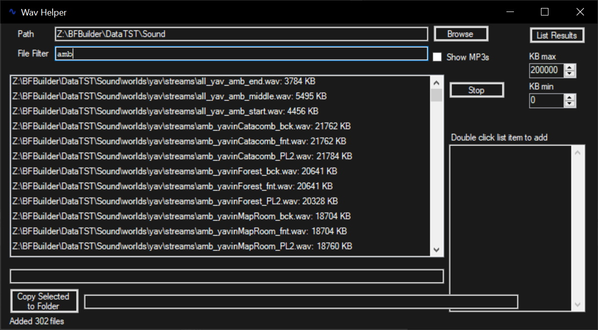

Simple Theming support for a Winforms application.
This approach will make the WinForms project a little themeable, but it's not perfect.
Because Winforms does not support theming very well.

There are several issues with theming WinForms applications.
1. System Dialogs are not theme-able.
2. Some controls do not support theming very well.
3. Scrollbars, CheckBoxes, RadioButtons ... not themed


## In Code Usage:
```C#
   new WinFormThemer(myForm) // apply the default dark theme to 'myForm'

   new WinFormThemer(myForm,themeConfig) // apply custom theme config to 'myForm'

   var themer = new WinFormThemer(); // uses default dark theme
   themer.ApplyTheme(myForm);

   var themer = new WinFormThemer(); // uses default dark theme
   themer.ApplyTheme(myForm);

   var themer = new WinFormThemer(themeConfig); // specify your custom theme
   themer.ApplyTheme(myForm);
```
## MessageForm
Since showing a message with 'MessageBox.Show(message)' is so common, an alternate messaging form is included.

```C#
    // API
        public static DialogResult ShowMessage(string message){}

        public static DialogResult ShowMessage(string message, string title){}

        public static DialogResult ShowMessage(string message, string title, bool showCancel, Icon icon){}

        public static String GetString(string initialText, string title){}

    // Usage:
    String userResponse = WinformThemer.MessageForm.GetString("Chocolate fudge", "What desert do you like?");

    WinformThemer.MessageForm.ShowMessage("You can't do that");

    if( WinformThemer.MessageForm.ShowMessage("Desert is a sweet after-dinner dish", "Do you want desert?") == DialogResult.OK)
    {
        Console.WriteLine("User wants desert");
    }
```

## VB.net support
copy and paste the code into the following web page to convert to VB.net
https://converter.telerik.com/

Note:
Event handlers may need to be corrected
```C#
//C#
form.HandleCreated += Form_HandleCreated
```
Should become:
```VB
'VB.net
AddHandler form.HandleCreated, AddressOf Form_HandleCreated

' Also may need to add a "End Function" to the "DwmSetWindowAttribute" sub declaration
```

## Creating your own Theme config
A default dark theme is included and can be easily customized.
By changing the following static property:
```C#
        public static WinFormThemeConfig DefaultDarkTheme
        {
            get
            {
                WinFormThemeConfig retVal = new WinFormThemeConfig();
                retVal.formBackground = "#1A1A1A";
                retVal.formForeground = "White";
                retVal.darkTitleBar = true;
                retVal.buttonBackground = "#1A1A1A";
                retVal.buttonForeground = "White";
                retVal.radioButtonBackground = "#1A1A1A";
                retVal.radioButtonForeground = "White";
                retVal.checkBoxBackground = "#1A1A1A";
                retVal.checkBoxForeground = "White";
                retVal.listItemBackground = "#1A1A1A";
                retVal.listItemForeground = "White";
                retVal.selection = "#403582";
                retVal.selectionText = "#403582";
                retVal.dataGridViewCellBackground = "#1A1A1A";
                retVal.dataGridViewBackground = "#252526";
                retVal.dataGridViewForeground = "White";
                retVal.textBoxBackground = "#1A1A1A";
                retVal.textBoxForeground = "White";
                retVal.menuBackground = "#1A1A1A";
                retVal.menuForeground = "White";
                return retVal;
            }
        }
    }
```

The themes can also be stored in JSON files
```JavaScript
{
    "formBackground": "#1A1A1A",
    "formForeground": "White",
    "darkTitleBar": true,
    "buttonBackground": "#1A1A1A",
    "buttonForeground": "White",
    "radioButtonBackground": "#1A1A1A",
    "radioButtonForeground": "White",
    "checkBoxBackground": "#1A1A1A",
    "checkBoxForeground": "White",
    "listItemBackground": "#1A1A1A",
    "listItemForeground": "White",
    "selection": "#403582",
    "selectionText": "#403582",
    "dataGridViewBackground": "#1A1A1A",
    "dataGridViewForeground": "White",
    "textBoxBackground": "#1A1A1A",
    "textBoxForeground": "White",
    "menuBackground": "#1A1A1A",
    "menuForeground": "White",    
}
```

Which Can be loaded into a 'WinFormThemeConfig' object and used like this:
```C#
 var config = WinFormThemeConfig.FromFile("myTheme.json");
 new WinFormThemer(myForm,config) // apply custom theme config to 'myForm'

 // or like this:
 var config = WinFormThemeConfig.FromFile("myTheme.json");
 var themer = new WinFormThemer(config) // apply custom theme config to 'myForm'
 themer.ApplyTheme(myForm);
```

## Default Dark Examples




